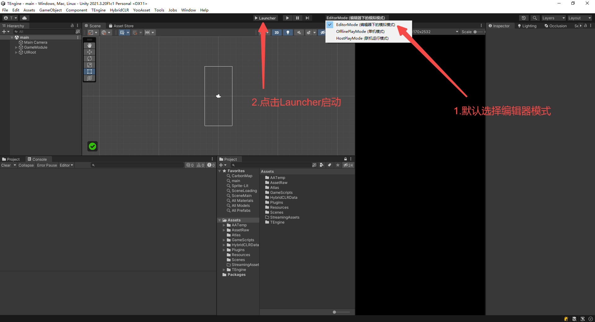
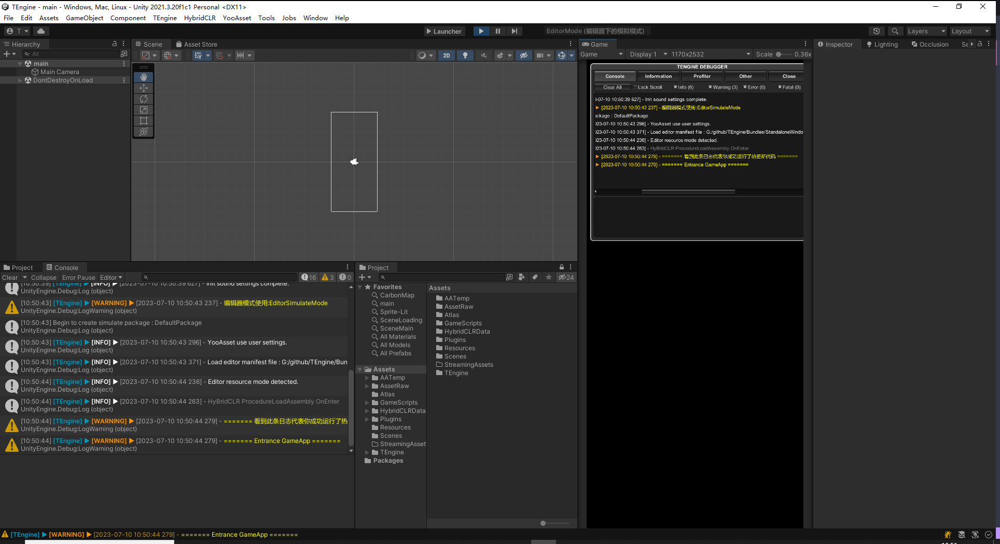

# 快速开始- Quickly Start
快速上手
本教程引导从空项目开始体验ZFramework。出于简化起见，只演示目标平台为Windows的情况。

请先在 Standalone 平台跑通资源构建与 Player 构建流程，再尝试 Android、iOS 等目标平台。

### 1.使用 Unity 2022.3.53f1 打开 `UnityProject` 工程。

### 2.默认选择顶部栏目EditorMode编辑器下的模拟模式并点击Launcher开始运行


### 3.Editor编辑器下运行成功！


### 4.打包运行
 *   1.运行菜单 YooAsset/AssetBundle Builder 构建默认资源包。
 *   2.打开 Build Settings 对话框，点击 Build And Run 构建并运行游戏。
 *   3.需要 DLC 或 Mod 时，为其创建独立 YooAsset Package，并在 `ProcedureInitContentPackages` 中完成清单发现、兼容性校验与可选挂载。

### 系统需求
默认版本：Unity 2022.3.53f1

支持版本: Unity 2022.3 LTS

支持平台: Windows、OSX、Android、iOS、WebGL

开发环境: .NET4.x

### 目录结构
```
Assets
├── AssetArt            // 美术资源目录
│   └── Atlas           // 自动生成图集目录
├── AssetRaw            // YooAsset 原始资源目录
│   ├── UIRaw           // UI图片目录
│   │   ├── Atlas       // 需要自动生成图集的UI素材目录
│   │   └── Raw         // 不需要自动生成图集的UI素材目录
├── Editor              // 编辑器脚本目录
├── Scenes              // 主场景目录
├── GameScripts         // 程序集目录
└── ZFramework             // 框架核心目录
    ├── AssetSetting    // YooAsset资源设置  
    ├── Editor          // ZFramework-Editor程序集
    └── Runtime         // ZFramework-Runtime程序集
```

### 程序集划分
```
Assets/GameScripts
├── Main                // 启动器与流程程序集
└── HotFix              // 历史目录名，不表示代码热更新
    ├── GameProto       // 游戏配置协议程序集，随 Player 构建
    └── GameLogic       // 游戏业务逻辑程序集，随 Player 构建
            └── GameApp.cs                  // 游戏主入口（partial class，可拓展）
```
