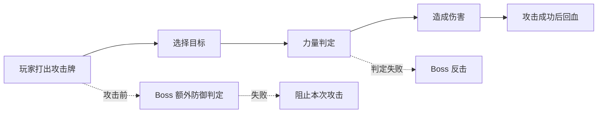
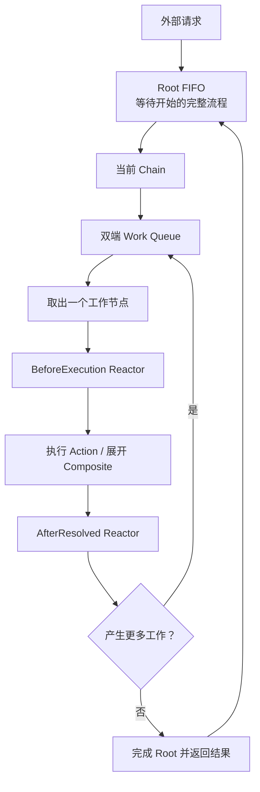
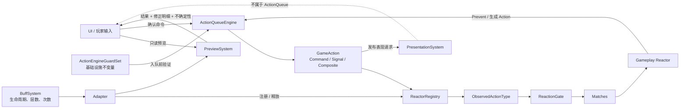
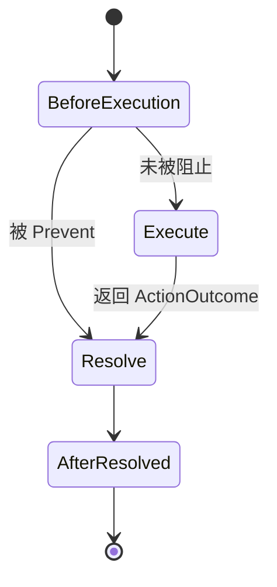
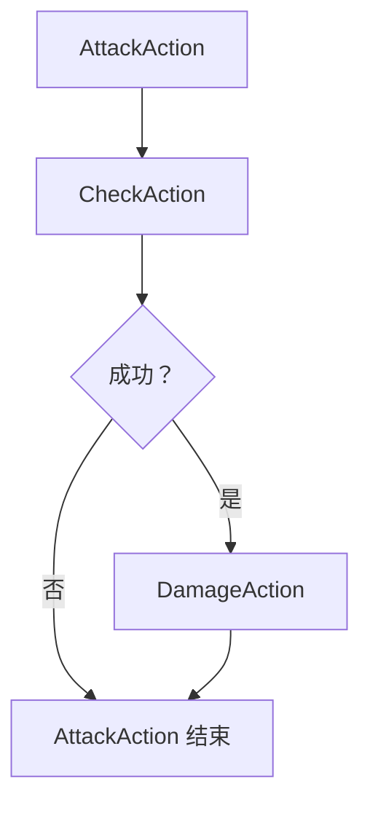
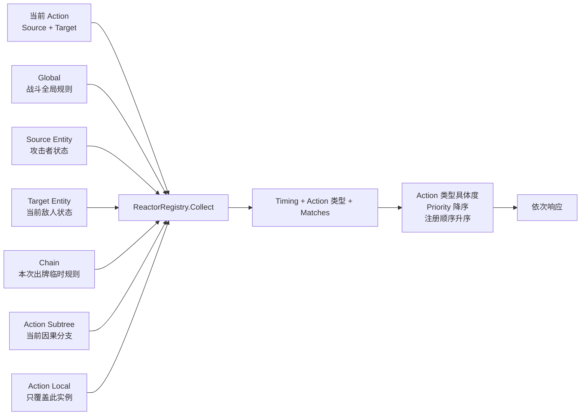
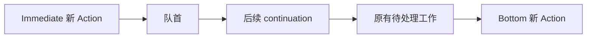
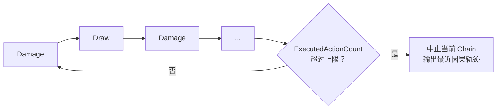

# ActionQueue 新手简介

> 一句话理解：把一次复杂游戏流程拆成许多小 `GameAction`，由一个非递归队列逐个执行；每个节点执行前后都允许 `Reactor` 观察、阻止、修改或插入新的 Action。

## 1. 这个系统解决什么问题

卡牌游戏的一次“攻击”通常不是一个函数调用，而是一条会继续生长的流程：



这里有四个难点：

1. 新效果可以继续产生 Action，流程长度无法提前确定。
2. 玩家输入、动画或网络结果可能需要异步等待。
3. 任意阶段都可能被状态、遗物或敌人能力响应。
4. 子 Action 的失败、阻止或取消必须回到父 Action，由父 Action 决定是否继续。

本系统不让 Action 直接调用另一个 Action，而是让所有后续工作回到同一条队列。这样流程再深也不会依赖 C# 调用栈递归。

## 2. 先认识五个核心概念

| 概念 | 通俗理解 | 代码角色 |
|---|---|---|
| Root Action | 外部提交的一整件事，例如“打出一张牌” | `runner.Enqueue(root)` |
| Chain | 一个 Root 产生的完整因果链 | 从 Root 开始，到所有衍生 Action 结束 |
| GameAction | 一个可独立结算的最小行为 | 判定、伤害、抽牌、选择目标 |
| Composite Action | 会按结果逐步产生子 Action 的父节点 | 完整攻击、整张卡牌流程 |
| Reactor | 在 Action 前后观察并响应的规则 | 状态、遗物、敌人能力、临时覆盖 |

核心心智模型：



同一时刻只处理一个 Chain。其他外部请求留在 Root FIFO 中，因此不同 Root 不会互相穿插。

### 系统关系总览

支持 Mermaid 的 Markdown 查看器（GitHub、Codex 等）会直接渲染下图；完整生命周期时序图见
[ActionQueue、BuffSystem 与 PreviewSystem 关系图](../COMBAT_SYSTEM_RELATIONSHIPS.md)。



ActionQueue 只处理游戏逻辑，不存在 `PresentationAction`。动画、音效、飘字由独立 PresentationSystem
处理。系统级不变量也不伪装成 Reactor，以免开发者把基础设施校验当作可被 Buff 抑制的玩法响应。

## 3. 一条 Action 如何结算

每个 Action 都经历三个逻辑阶段：



分步看：

1. Engine 从 Work Queue 取出 Action 的 `Before` 工作项。
2. Registry 收集所有匹配的 `BeforeExecution Reactor`。
3. Reactor 按优先级依次执行，可以修改 Action、阻止 Action，或插入新 Action。
4. 未被阻止的普通 Action 执行 `ExecuteAsync`；Composite 则生成下一个子 Action。
5. Action 得到明确的 `ActionOutcome`。
6. Runner 收集并执行 `AfterResolved Reactor`。
7. 子 Action 的结果通过 continuation 返回父 Composite；父节点再决定下一步。

结果不是简单的 `true/false`：

| 结果 | 含义 | 常见例子 |
|---|---|---|
| `Succeeded` | 行为成功发生 | 伤害已造成 |
| `Failed` | 行为执行了，但规则判定失败 | 力量检定失败 |
| `Prevented` | 前置规则让行为无效 | Boss 防御使攻击失效 |
| `Cancelled` | 玩家或外部系统取消 | 关闭选目标界面 |

`Failed` 与 `Prevented` 必须区分：Boss 可以监听“力量判定失败”进行反击，但一次被提前阻止的攻击不应被误认为判定失败。

## 4. Composite 为什么不会递归

假设 `AttackAction` 依次包含“力量判定”和“伤害”：



Engine 不会在 `AttackAction.Execute()` 内直接执行 `CheckAction`。它实际把工作拆成：

```text
初始：      [Attack.Before]
展开父节点：[Check.Before, Attack.Continuation]
子节点完成：[Attack.Continuation]
继续父节点：[Damage.Before, Attack.Continuation]
最后：      [Attack.Resolve]
```

`Continuation` 只是队列中的普通内部工作项。即使 Composite 里面再嵌套 Composite，仍然只是继续添加工作项，不会增加执行器的递归深度。

## 5. Reactor 从哪里来

Reactor 按作用范围分成六层：

- 全局：整个队列实例中的规则；
- 实体：随 Source/Target 路由的长期能力；
- Chain：一个根流程中的所有 Action；
- 子树：一个 Action 自身及全部因果后代；
- 后代：全部因果后代，但不含声明它的 Action；
- Local：只观察一个 Action 实例。

子树作用域跟随运行时父子关系传播。Composite 子节点、Reactor 插入的 Action，以及 Action 自己通过
`EnqueueImmediate/EnqueueToBottom` 产生的 Action，都会继承父节点的子树 Reactor；其他兄弟分支和
不相关 Root 不会继承。

Reactor 是否最终执行由三层正交筛选决定：

```text
ObservedActionType
    粗筛：这个 Reactor 关心哪类 Action

Matches
    自筛：这个 Reactor 在什么业务条件下触发

ReactionGate
    外部抑制：这个 Action 是否允许该 Reactor 触发
```

例如“攻击不触发反击”应由 `ReactionGate` 拒绝带 `Counterattack` 标签的 Reactor，而不是关闭整个
`AfterResolved` 阶段。系统完整性检查不使用 Reactor，而由不可被玩法规则屏蔽的 `ActionEngineGuardSet`
在 Action 入队前执行。



这解决了“攻击不同敌人，应监听不同 Reactor”的问题：

- Hero 身上的“攻击成功后回血”注册为 Source Entity Reactor。
- Boss 身上的“攻击前额外判定”和“力量失败后反击”注册为 Target Entity Reactor。
- 攻击 Slime 时只收集 Hero 与 Slime 的实体 Reactor，不会触发 Boss 的能力。

注册实体 Reactor 后要保存并释放返回的 `IDisposable`：

```csharp
IDisposable thorns = runner.Reactors.RegisterForEntity(
    enemy,
    new ThornsReactor(),
    ReactorRelation.Target);

// 状态移除、实体死亡或战斗结束时：
thorns.Dispose();
```

## 6. 新 Action 插到哪里

系统提供两种位置：

| API | 位置 | 适用场景 |
|---|---|---|
| `EnqueueImmediate` | 当前双端队列头部 | 反击、荆棘、立刻结算的触发效果 |
| `EnqueueToBottom` | 当前双端队列尾部 | 延后结算、等待当前局部流程结束 |



`Immediate` 使用逆序插入来保持 Reactor 声明的 A、B 仍按 A、B 执行。

## 7. 等待玩家输入

需要等待输入的 Action 直接在 `ExecuteAsync` 中等待，并传递取消令牌：

```csharp
protected override async UniTask<ActionOutcome> ExecuteAsync(
    ActionExecutionContext context,
    CancellationToken cancellationToken)
{
    Combatant target = await selector.ChooseTargetAsync(cancellationToken);
    return target == null
        ? ActionOutcome.Cancelled("Player cancelled target selection.")
        : ActionOutcome.Success();
}
```

等待期间 Engine 不会启动同一 Chain 的下一个节点。调用 `runner.StopAndClear()` 时，遵守这个 `CancellationToken` 的异步操作会被取消。

动画和音效应由独立 PresentationSystem 处理，不做成 GameAction。Action 可以发布后立即继续，或通过
`context.AwaitPresentationAsync(handle.WaitForCompletionAsync())` 明确等待。Runner 的
`SkipPresentationWaits` 只覆盖这种表现等待，不影响玩家输入、网络或其他业务异步操作。

## 8. 如何防止 Damage → Draw → Damage 无限循环

系统不尝试猜测哪两个效果构成循环，而是给每条 Chain 一个 Action 预算：



默认 `maxActionsPerChain = 128`。它既保护直接自循环，也保护跨 Reactor 的间接循环。这个值应高于游戏中最大的合法连锁数量，并用测试覆盖“合法上界”和“上界 + 1”。

## 9. 最短上手流程

1. 在场景 GameObject 上添加 `ActionQueueRunner`。
2. 继承 `GameAction` 实现最小行为，并返回 `ActionOutcome`。
3. 需要多阶段流程时继承 `CompositeGameAction`，根据 `CompletedOutcomes` 返回下一个子 Action。
4. 给 Action 正确暴露 `Source` 与 `Target`。
5. 将状态、遗物和敌人能力写成 Reactor，并注册到正确范围。
6. 创建新的 Action 实例并调用 `await runner.Enqueue(root)`；Action 实例不可重复入队。
7. 在 `Window → Card Game → Action Queue Debugger` 中观察队列和完整因果树。

可直接运行 [Examples/ActionQueueExamples.cs](Examples/ActionQueueExamples.cs) 中的五个案例。

## 10. 代码从哪里读起

```text
Core/GameAction.cs                  Action 与执行上下文
Core/CompositeGameAction.cs         父子流程协议
Core/ActionQueueEngine.cs           Root Queue 与 Work Queue 执行器
Core/ActionQueueEngine.Actions.cs   Action 与 Composite 结算
Core/ActionQueueEngine.Reactions.cs Reactor 批次与衍生 Action 入队
Core/ActionQueueEngine.WorkItems.cs 工作项状态机
Reactions/GameActionReactor.cs      Reactor、Context 与 Response
Reactions/ReactorRegistry.cs        Reactor 来源路由、过滤和排序
Debugging/                          运行时调试记录与断点
Unity/ActionQueueRunner.cs          MonoBehaviour Adapter
Editor/ActionQueueDebuggerWindow.cs 可视化调试窗口
Examples/                           可运行案例
```

## 11. 性能与优化

性能基准、热点证据和分级优化路线已移至 [ActionQueue 性能优化审查](PERFORMANCE.md)。

## 12. 使用边界

- Engine 按 Unity 主线程、单执行泵设计，不支持多个线程同时修改 Registry 或入队。
- `StopAndClear()` 无法强制终止完全忽略 `CancellationToken` 的第三方异步代码。
- Action 实例是一次性的；重复入队会抛出异常。
- Reactor 的 `Matches` 与 `React` 应保持短小；需要等待或展示动画时，应生成新的 Action，而不是在 Reactor 内阻塞。
