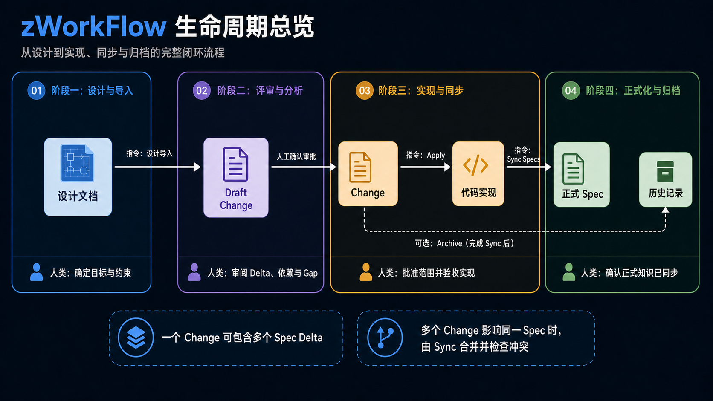

# Agent 工作流介绍

服务于游戏开发的ai辅助工作流。可视化工作台暂时依赖Unity，使用者可按需求移植到其他项目环境。

使用方式（二选一）：

- 在项目根目录运行 `npx --yes github:Hubr1zz/zWorkFlow setup`，自动下载干净包并验证 OpenSpec。
- 手动下载分发包，以 `zWorkFlow/` 文件夹名原样放入项目根目录，再让 Agent 读取 `zWorkFlow/setup/SETUP_NEW_PROJECT.md` 并执行完整 setup；不要把包内文件摊平到项目根目录。

CLI 只处理可确定的安装步骤，不覆盖已有工作流；随后按终端提示让 Agent 完成项目适配。

## 如果只想迁移项目数据

不要复制 `zWorkFlow/`、通用 skills、setup 脚本或工具适配目录。只迁移项目拥有的数据：

- `openspec/` 中的正式 Spec、Change、Draft、翻译与元数据；目标已有同名 JSON 时按稳定 ID 合并，不直接整目录覆盖。
- `.agents/skills/project-*` 中的项目事实、领域规则、工程能力目录和重构队列；目标已有框架资料时改成独立领域 skill 或合并 references。
- `.agent-memory/.../team/` 中需要保留的成员映射与个人规范。本机路径、安装状态、代码索引和旧 GUID 可复制到带来源名的迁移档案，不应覆盖目标当前状态。

迁移后让 Agent 更新代码证据路径、项目索引和 tooling catalog，并重新运行目标项目的编译/验证。工作流与工具本身仍使用目标项目已经安装的版本。

## 它能做什么

- 回答项目现在是怎样工作的，并指出信息来自哪些文件。
- 在 C# 项目中先用本地结构预处理代码索引，减少重复搜索和文件读取。
- 把游戏设计文档整理成可以审阅的规则和开发计划。
- 比较设计与现有代码，告诉你哪些已经实现、哪些还缺失或冲突。
- 在你批准计划后实现功能，并记录进度。
- 用关系图谱展示功能模块的依赖、阻塞项、待合入 Change 和核心实现思路。
- 用独立的工程能力目录记录 Plugin、可复用 Architecture 和项目 System；Plugin 可填写使用判断依据，Architecture 默认强制复用且修改前必须确认。
- 帮助整理代码、同步文档和维护技术债。
- 支持双语言同时工作

## 支持的 AI 软件

同一项目可以由不同团队成员同时使用以下 7 种 AI 软件：

- OpenAI Codex
- Claude Code
- Cursor
- GitHub Copilot
- Gemini CLI
- Windsurf
- Kimi Code CLI

它们共用 `.agents/skills/`、OpenSpec 和项目文档；需要专属入口的软件由 setup 安装薄适配层，不会复制另一套完整工作流。

## 与 OPSX 的关系

zWorkFlow 的 Spec 生命周期参考了 OpenSpec 的 OPSX：保留 Proposal/Change、Delta Spec、Apply、Sync 和 Archive 的职责分离。为了降低日常使用门槛，它把 `new`、`continue`、快速生成和验证等多步操作收敛为自然语言提案或“设计导入”，再通过 Workbench 完成审阅、批准、同步与归档；Unity 集成、依赖门禁、双语显示和代码索引属于 zWorkFlow 的扩展。

## 最简单的使用方式

直接用自然语言告诉 AI 你的目标，例如：

```text
解释当前核心流程是怎样切换的。
修复背包系统无法正确刷新的问题。
设计导入：角色成长系统
重构角色状态同步流程，但不要改变外部行为。
```

小问题通常可以直接处理。较大的功能会先形成一个待审阅的 Change，让你先看到目标、规则、依赖和任务，再决定是否批准实现。

## 从设计文档生成计划

常用命令：

```text
设计导入
设计导入：角色成长系统
设计导入：角色成长系统 --规则
设计导入：角色成长系统 --内容 --美术
翻译现有Spec：英文
```

每个 Spec 只有原路径中的一份权威内容。团队共享的其他语言版本保存在 `openspec/translations/`，只用于 Workbench 显示；翻译缺失或权威内容变化后，Workbench 会隐藏旧译文并提供可复制的同步指令。Spec 条目名称按 capability ID 在 `openspec/localization.json` 中维护中英文显示值，两种语言都可在对应界面下重命名；列表、依赖树、关系图和可读引用随当前语言切换，但生命周期与依赖键始终使用原 ID。

导入不会修改原设计文档。AI 会先按状态归属、生命周期、输入输出和独立验收边界拆成模块，再整理规则、检查代码、合并重复内容，并把每个模块放进独立 Draft Change 等待你审阅。

EventBus、状态机基类和注册表等普通工具不会因为“被复用”就占据一个 Spec 节点。只有它们形成多个功能必须遵守的项目稳定契约，或本次确实要改变派发模型、订阅生命周期等公共语义时，才生成 System Spec 和真实依赖关系；可独立复用的 Architecture 进入工程能力目录。

如果同一内容以前已经导入过，工作流会优先复用或更新原来的记录，不会再生成一份相同提案。

## 在 Workbench 中看什么

- **导入报告**：查看从设计文档生成的 Draft Change、规则、代码差异和待处理问题。进入某次导入后，左侧返回按钮右侧的“导入记录信息”与下方 Spec 条目控制右侧内容，两种详情互斥显示。
- **OpenSpec**：查看已经批准的 Change 和正式 Spec。配对 Change 仍是一个条目，但详情会同时列出 Feature 与游戏规则的增量 Spec；切换分类页签时对应类型优先显示。
- **增量维护**：查看需要整理或重构的项目问题。
- **设计文档树**：页面顶部只维护一个或多个本机“设计文档路径”。每个来源显示为独立顶层节点，子目录可逐层折叠；实现进度由正式 `implementation.json`、active Change 与校验有效的派生 Summary 投影，不再维护全局实现 Ledger。“检查”只重扫 Markdown 与刷新派生状态，不自动调用设计导入。
- **指令列表**：集中列出设计导入与筛选、检查文档及时性、修改导入、翻译/同步 Spec 翻译、apply、sync 与归档的标准用户指令。
- 顶部刷新按钮右侧的 **关系图谱**：节点使用显示名称，颜色区分 System / Feature / Change；视口左上角可显隐 Change 节点且保留隐藏前位置，下方彩色状态柄显示“待 Sync、实现中、待合入 Delta、已实现、阻塞”。核心实现思路支持多行展示。
- 关系图谱右侧的 **工程能力**：展示 Plugin、Architecture、System 的关系、说明、证据和约束。Plugin 的“判断依据”可直接保存；留空时 Agent 根据项目风格判断。Architecture 固定为 required + locked，Agent 修改前必须先询问用户。

常见状态：

- **Draft Change**：仍在讨论和修改，还不会实施。
- **Change**：已经批准，可以开始实现。
- **Spec**：已经确认并完成同步的正式规则或功能说明。
- **Blocking**：必须先解决的问题。
- **Warning / Info**：可以修改，也可以由你明确接受。
- 审核区用彩色级别图标和表格集中展示问题；非阻塞项可逐行勾选接受并填写“接受备注”，该备注会写入 `acceptanceNote` 供实现时参考。

## Draft Change、Change 与正式 Spec

### Draft Change：等待人确认的候选方案

Draft Change 是从设计文档提炼出的可修改提案，包含目标、Delta、依赖、Gap、审核问题和预计任务。它还不具备实施资格，也不会改动代码或正式 Spec。你可以要求 AI 使用 `修改<id>: <修改内容>` 继续调整，确认范围和阻塞项都正确后再批准。

一次设计导入可以拆出多个 Draft Change；Feature 与它配套的游戏规则也可以作为一个配对条目共同审阅。这里的拆分重点是“能否独立理解、批准和验收”，不是按文件数量机械拆分。

### Change：已经批准的实现沙箱

Change 是获批后进入 `openspec/changes/` 的实施计划。它保存的是相对正式 Spec 的 **Delta（增量）**，而不是另一份完整 Spec。一个 Change 可以同时包含多个 Spec 的 Delta，例如同一次功能修改既调整 Feature Spec，也调整游戏规则 Spec；这些增量作为同一批准范围一起实现、核验和同步。

`apply` 会按照 Change 的 Tasks 修改代码、测试和 Change 内验证记录，但不会直接改正式 Spec。正常代码产出由源码、Git 和活动 Change 共同记录，不会全部复制到“增量维护”。只有实现时新发现、明确延期的技术债、非功能重构或架构风险，才进入增量维护队列。

### 正式 Spec：团队当前认可的项目契约

正式 Spec 位于 `openspec/specs/`，只描述团队当前认可的游戏玩法、玩家可观察规则与 Player 运行时契约。编辑器、工作台、索引、构建、测试、调试和 Agent 工作流能力归对应 Skill、zWorkFlow 文档/测试或 `project-tooling`，不得进入正式 Spec。正式 Spec 不是代码改动日志，也不是某个 Change 的私有副本；只有显式执行 `sync specs <change-id>`，经过范围门禁与合并检查后，Change 的 Delta 才会进入。

多个活动 Change 可以同时影响同一个正式 Spec。它们在实施期间保持彼此独立；每次 sync 都使用该 Change 的基线快照、当前正式 Spec 和自身 Delta 做三方判断。不重叠的信息会合并保留，可能覆盖同一语义或产生冲突时则停止同步并要求人工审查。因此，正式 Spec 最终呈现的是已同步 Change 的合并结果，而不是简单选择其中一份覆盖其他内容。



## Change 如何进入正式历史

```text
Draft Change → 批准 → Change → apply → 手动 sync → Archive
```

- `apply` 只实现代码并更新 Change 内记录，不会自动修改正式 Spec。
- `sync` 会用 Change 建立时的基线快照、当前正式 Spec 和 Delta 做三方判断。正式 Spec 即使被创建、删除或修改，也不会仅因文件发生变化就直接阻止；不重叠内容会保留合并，可能覆盖功能或混杂语义时才要求审查并阻塞。
- 所有 Tasks 完成且 Spec 已同步后，Change 详情中的“归档”按钮才会启用。归档只是把完整 Change 移入带日期的 `archive` 历史目录；设计、Tasks、备注和审计仍可手动查看。删除才是永久移除。

## 你始终拥有决定权

- Draft 不会自动变成正式计划。
- 有阻塞问题时不会开始实现。
- AI 不会因为“可能需要”就补写未确认的玩法。
- 设计导入不会直接生成正式 Spec；实现并核验完成后才会同步。
- 每个 Change 会用明确的新增、修改、删除或重命名标记描述待合入内容，并在批准前自动做严格格式校验；用户不需要手工维护这些标记。
- 代码证据会显示“有效/修改过/文件缺失/已失效”；“修改过”不阻止审批，AI 会在 apply 前自动重核验，失效时先调整 Change。
- 深色主题会使用更清晰的控件线框；节点正文不重复显示已由颜色表达的类型。
- 删除、覆盖和其他高风险操作需要明确目标，并尽量保留可恢复路径。

第一次使用时，可以继续阅读 [快速上手](WORKFLOW_QUICKSTART.md)。如果你要维护或扩展这套工作流，再查看附带的 [二次开发者说明](WORKFLOW_DEVELOPER_GUIDE.md)。

## 额外优化

这些附属能力不会改变主流程，主要用于降低检索、适配与团队协作成本：

- **C# 查询加速**：为 Unity/C# 项目生成可重建的本地结构索引，先定位类型、方法、调用者和影响范围，再读取少量源码核验，减少重复搜索与工具调用。
- **工作流自动软适配**：setup 会先识别项目已有规则、目录和 AI 工具，只补充缺失的共享能力与薄入口，不覆盖现有工作流；条件不满足时安全回退到原生检索和平台默认能力。
- **成员偏好**：按当前成员单独读取沟通、实现和验收偏好，不加载其他成员资料，也不会让个人习惯覆盖项目规则或安全约束。
- **多工具共享**：Codex、Claude Code、Cursor 等工具共用同一份 Skills、Spec 和项目事实，各工具只保留必要的轻量适配层，避免维护重复规则。
- **双语显示**：Spec 保持单一权威文件，中文和英文译文仅用于工作台显示；块级 hash 只同步变化内容，并阻止过期译文继续展示。
- **游戏架构审查**：针对权威状态、Unity 生命周期、序列化/GUID、asmdef、资源与测试边界给出少量有证据的候选，不强制生成额外报告。
- **证据优先验证**：按改动风险选择纯 C#、Unity 编译、EditMode/PlayMode 或兼容检查；只把最后一次真实运行标为通过，未执行项明确显示为未验证。
- **Agent 与模型路由**：仅在任务上下文适合拆分时使用子 Agent，并按平台实际能力选择查询、编码或深度推理模型；无法可靠判断时沿用平台默认设置。
- **按需读取与维护保护**：项目索引、领域文档、成员规则和技术债队列只在命中任务时读取；保护清单、阻塞门禁和可审计记录降低误改风险。

## 许可证

zWorkFlow 采用 [Apache License 2.0](LICENSE) 发布；第三方衍生内容保留其 [许可声明](THIRD_PARTY_NOTICES.md)。
